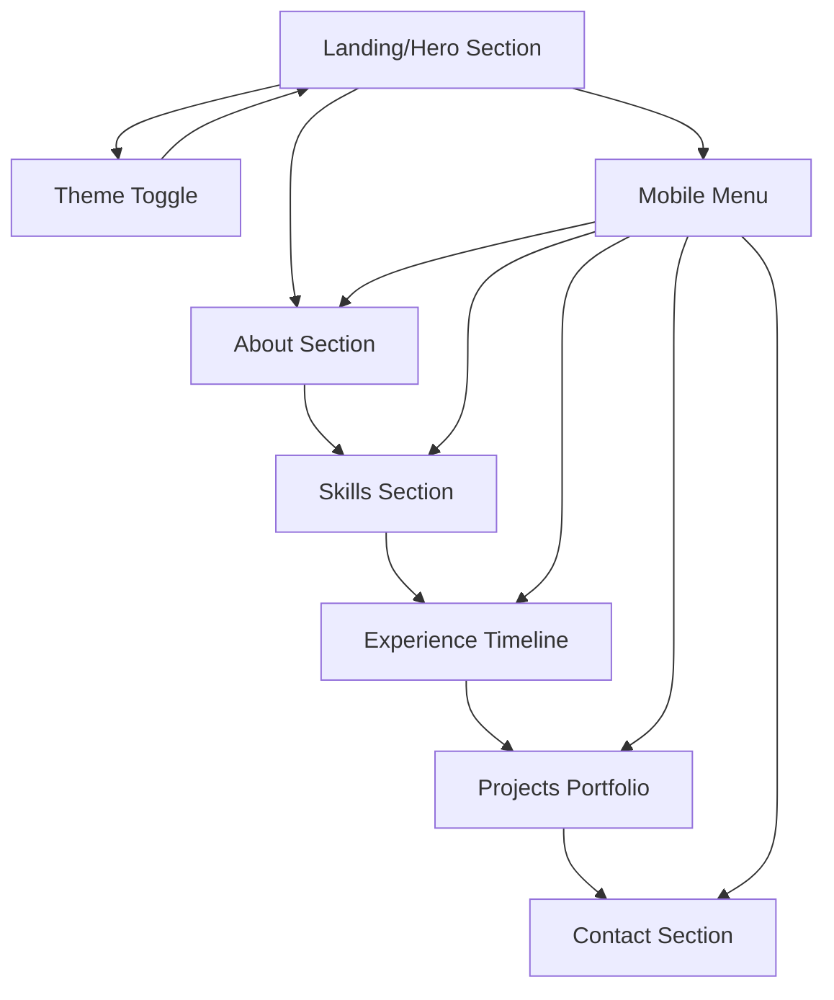

# Portfolio Modernization Requirements

## 1. Product Overview
Modernize the existing personal portfolio website with contemporary minimal design principles, incorporating smooth animations, responsive layouts, and a sophisticated blue-green color palette with seamless light/dark theme support.

The modernization aims to enhance user experience through clean aesthetics, improved performance, and accessibility while maintaining the professional developer identity. Target outcome is a cutting-edge portfolio that reflects current 2024 design trends and attracts potential employers and clients.

## 2. Core Features

### 2.1 User Roles
No specific user roles required - the portfolio serves as a public showcase accessible to all visitors without authentication requirements.

### 2.2 Feature Module
Our modernized portfolio consists of the following essential pages:
1. **Home Page**: Hero section with animated typing effect, professional introduction, key statistics display, and call-to-action buttons.
2. **About Section**: Personal story, professional highlights, achievement showcase, and personality-driven content.
3. **Skills Section**: Interactive skill visualization, technology expertise display, and proficiency indicators.
4. **Experience Section**: Timeline-based career progression, achievement highlights, and impact metrics.
5. **Projects Section**: Portfolio showcase with project details, technology stacks, and live demo links.
6. **Contact Section**: Professional contact form, social media links, and downloadable resume access.

### 2.3 Page Details

| Page Name | Module Name | Feature Description |
|-----------|-------------|--------------------|
| Home Page | Hero Section | Implement animated gradient backgrounds, smooth typing animation with multiple role titles, floating particle effects, and responsive layout with mobile-first approach |
| Home Page | Statistics Display | Create animated counter components showing years of experience, projects completed, and impact metrics with smooth number transitions |
| Home Page | Navigation Bar | Design glassmorphism-style navigation with smooth scroll indicators, theme toggle button, and mobile hamburger menu with slide animations |
| About Section | Personal Story | Develop engaging narrative layout with animated text reveals, professional photo integration, and highlight boxes for key achievements |
| About Section | Achievement Showcase | Build interactive cards displaying awards, certifications, and career milestones with hover effects and smooth transitions |
| Skills Section | Technology Grid | Create responsive skill cards with animated progress bars, technology icons, and proficiency level indicators using modern CSS animations |
| Skills Section | Interactive Visualization | Implement skill category filters, animated skill level displays, and technology stack groupings with smooth transitions |
| Experience Section | Timeline Component | Design vertical timeline with animated entry points, company logos, role descriptions, and achievement highlights with scroll-triggered animations |
| Experience Section | Impact Metrics | Showcase quantifiable achievements with animated counters, progress indicators, and visual impact representations |
| Projects Section | Portfolio Gallery | Build responsive project grid with hover effects, technology tag displays, live demo buttons, and detailed project modals |
| Projects Section | Project Details | Create expandable project cards with image galleries, technology stacks, challenge descriptions, and solution highlights |
| Contact Section | Contact Form | Implement modern form design with floating labels, validation feedback, success animations, and email integration |
| Contact Section | Social Integration | Design social media link grid with hover animations, professional profile links, and downloadable resume functionality |

## 3. Core Process

**Visitor Journey Flow:**
Visitors land on the hero section with immediate visual impact through animated elements and clear value proposition. They scroll through sections discovering professional background, technical expertise, career progression, and project portfolio. The experience concludes with easy contact options and social media connections.

**Theme Toggle Flow:**
Users can seamlessly switch between light and dark themes using the navigation toggle button. The transition applies smooth color scheme changes across all components while maintaining visual hierarchy and readability.

**Mobile Experience Flow:**
Mobile users access a fully responsive design with touch-optimized interactions, collapsible navigation, and adapted layouts that maintain functionality across all device sizes.

## 4. User Interface Design

### 4.1 Design Style
**Color Palette:**
- Primary: Deep Ocean Blue (#1e40af) and Teal Green (#0891b2)
- Secondary: Soft Sky Blue (#3b82f6) and Emerald (#059669)
- Accent: Electric Blue (#6366f1) and Mint Green (#10b981)
- Neutral: Slate grays (#64748b, #475569, #1e293b) for text hierarchy

**Typography:**
- Primary Font: Inter (clean, modern sans-serif)
- Code Font: Fira Code (monospace for technical content)
- Font Sizes: Responsive scale from 14px to 48px with fluid typography

**Design Elements:**
- Button Style: Rounded corners (8px radius), gradient backgrounds, subtle shadows, and hover animations
- Layout: Card-based design with glassmorphism effects, generous whitespace, and grid-based responsive layouts
- Icons: Feather icons or Heroicons for consistency, with subtle animations on hover
- Animations: Smooth 0.3s ease transitions, scroll-triggered reveals, and micro-interactions

### 4.2 Page Design Overview

| Page Name | Module Name | UI Elements |
|-----------|-------------|-------------|
| Home Page | Hero Section | Gradient background (#1e40af to #0891b2), floating particles, glassmorphism card overlay, animated typing text in #6366f1, CTA buttons with gradient backgrounds |
| Home Page | Navigation | Glassmorphism navbar with backdrop-blur, theme toggle with smooth icon transitions, mobile menu with slide-in animation from right |
| About Section | Content Layout | Two-column responsive layout, animated reveal cards in --card-bg with blue-tinted shadows, highlight boxes with #10b981 accent borders |
| Skills Section | Skill Grid | Responsive CSS Grid, skill cards with hover lift effects, animated progress bars using #0891b2 to #059669 gradients, technology icons with subtle pulse animations |
| Experience Section | Timeline | Vertical timeline with #6366f1 connecting line, animated milestone markers, company logo integration, achievement cards with glassmorphism styling |
| Projects Section | Portfolio Grid | Masonry-style responsive grid, project cards with hover overlay effects, technology tags with #1e40af background, modal overlays with smooth transitions |
| Contact Section | Form Design | Modern form styling with floating labels, #0891b2 focus states, success animations with #10b981 colors, social icons with hover color transitions |

### 4.3 Responsiveness
The portfolio follows a mobile-first responsive design approach with breakpoints at 640px, 768px, 1024px, and 1280px. Touch interactions are optimized for mobile devices with appropriate touch targets (minimum 44px), swipe gestures for project galleries, and adaptive layouts that maintain visual hierarchy across all screen sizes. The design ensures optimal performance on both desktop and mobile devices with smooth animations and fast loading times.